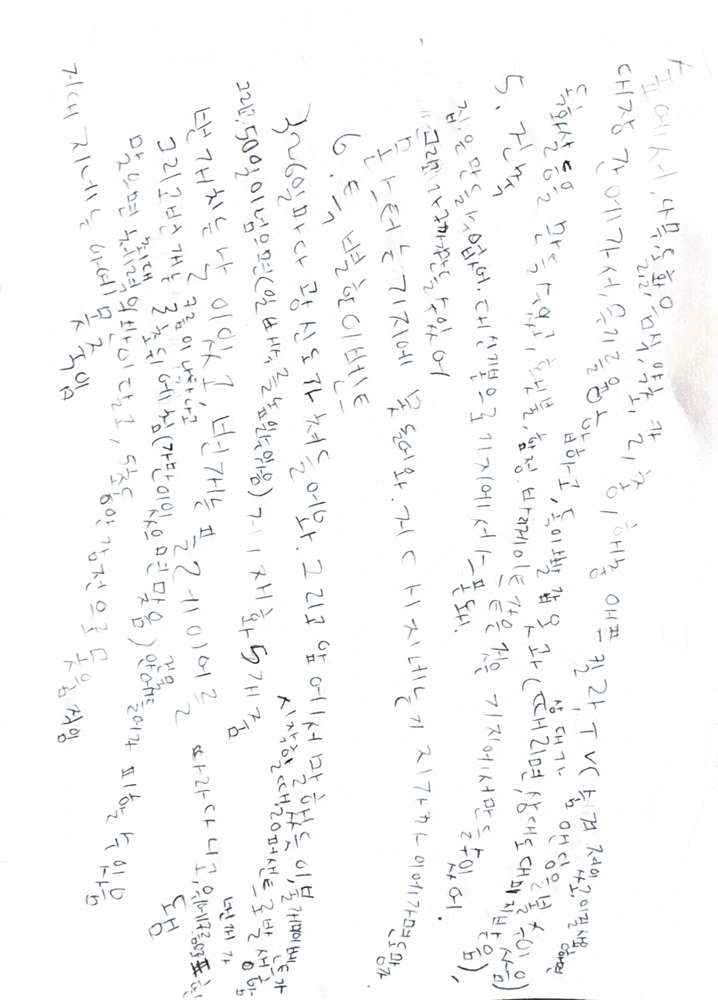
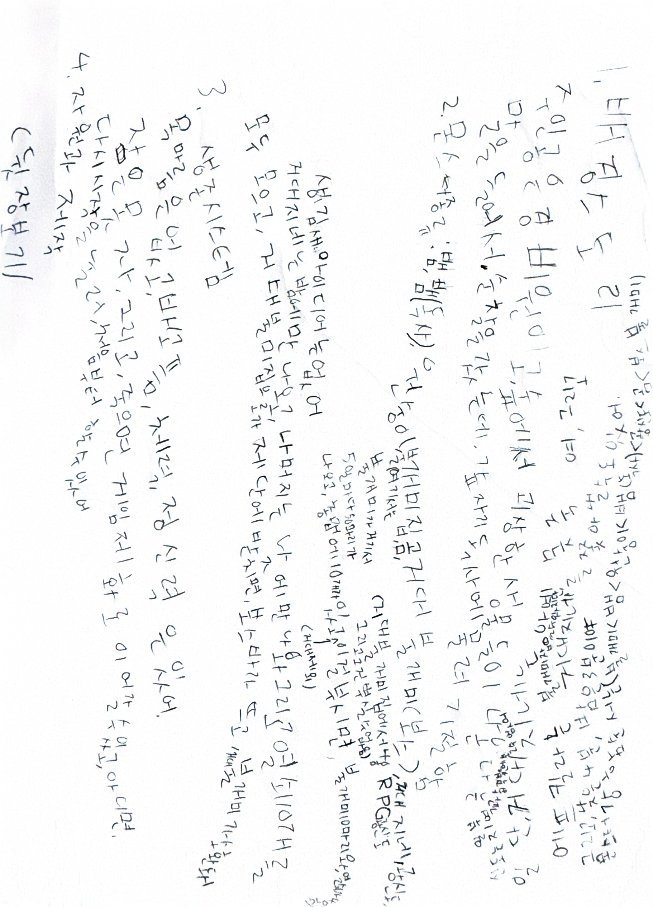

# 🌲 99 Nights in the Forest

[](README.md)

> Survive 99 days in the forest and defeat the Forest Guardian!

A low-poly survival game built with Three.js + React.

## 🎮 Play Now

**[https://forest99.vercel.app](https://forest99.vercel.app)**

## 📖 Story

You are trapped in a mysterious forest. Survive for 99 days, defeat the Forest Guardian, and escape!
Gather resources during the day, and survive monsters at night!

## 🎨 Origin

This game started from a 7-year-old's idea.

### Original Design Document

<p align="center">
  
  
</p>

## ✨ Features

### Survival System
- **HP** - Health management
- **Hunger** - Need to eat food
- **Sanity** - Recover at base camp

### Day/Night Cycle
- 60-second day/night transitions
- Stronger monsters appear at night
- Sanity decreases rapidly

### Monsters
| Day | Night |
|-----|-------|
| 🐍 Snake | 🐛 Giant Centipede |
| 🐒 Monkey | 👤 Cultist |
| 🐻 Bear | 🐺 Wolf Pack |
| 🐜 Fire Ant | |
| 🧚 Forest Fairy | |
| 🗿 Ancient Golem (Day 50+) | |

### Combat
- 5 weapon types (Fist → Branch → Stone Axe → Spear → Torch → Reinforced Axe)
- Combo system (up to 5 combos, +20% damage)

### Crafting
- Collect wood, stone, fiber, and other resources
- Craft weapons and tools
- Create healing items

### Events
- Dense fog, storms, monster raids
- Blood moon, earthquakes, resource abundance
- Full moon, forest blessing, shadows in the mist

### Boss
- **Forest Guardian** appears on Day 99
- 3-phase battle
- HP 3000

## 🎮 Controls

### Desktop

| Key | Action |
|-----|--------|
| WASD | Move |
| Shift | Run |
| Space | Jump |
| Mouse | Look/Attack |
| I | Inventory |
| C | Crafting |
| E | Gather |
| ESC | Pause |

### Mobile

- Left joystick for movement
- Right touch for camera rotation
- On-screen buttons for actions

## 📱 Features

- ✅ PWA support (offline play, home screen install)
- ✅ Mobile touch support
- ✅ Save/Load
- ✅ Tutorial
- ✅ Achievement system (12 achievements)
- ✅ Localization (Korean/English)

## 🛠 Tech Stack

- **Frontend:** React 18, Vite
- **3D:** Three.js, React Three Fiber, Drei
- **State:** Zustand
- **Audio:** Howler.js
- **i18n:** i18next
- **Deploy:** Vercel

## 🚀 Local Development

```bash
# Install dependencies
npm install

# Run dev server
npm run dev

# Build
npm run build
```

## 📁 Project Structure

```
src/
├── components/
│   ├── game/       # Game objects
│   ├── effects/    # Visual effects
│   ├── lowpoly/    # 3D models
│   └── ui/         # UI components
├── stores/         # Zustand stores
├── systems/        # Game systems
├── data/           # Game data
├── i18n/           # Localization
├── hooks/          # React hooks
└── utils/          # Utilities
```

## 🗺️ Roadmap

### v1.1 - Gameplay Improvements
- [ ] **Character** - Player model and animations
- [ ] **Combat Feel** - Screen shake, hitstop, enhanced effects
- [ ] **Camera** - Distance/angle options, zoom in/out
- [ ] **Mobile Fullscreen** - PWA fullscreen mode, screen rotation lock

### v1.2 - Content Expansion
- [ ] **New Monsters** - Wolf pack, forest fairy, ancient golem implementation
- [ ] **New Weapons** - Bow, magic staff
- [ ] **NPCs** - Merchant, helper
- [ ] **Quest System** - Daily missions, expanded achievements

### v1.3 - Social & QoL
- [ ] **Leaderboard** - High score rankings
- [ ] **Sound Improvements** - Footsteps, ambient sounds, monster sounds
- [ ] **Settings Menu** - Graphics/sound/control settings
- [ ] **Tutorial Enhancement** - Interactive guide

---

## 📄 License

MIT License

## 🙏 Acknowledgments

Special thanks to my child for the amazing game idea!
